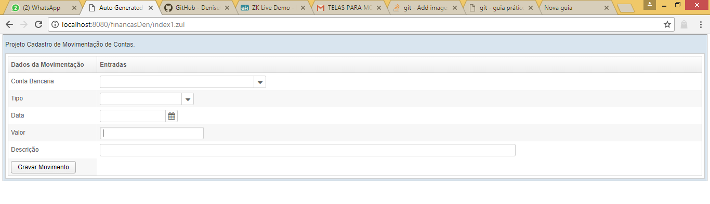

# Financas
Financas

Trabalho do Professor Diego Guedes metodologias Java, Hibernate, JPA, RMI e ZK.

Alunas: Denise Oliveira Cruz.
        Cristiane Cirqueiro Nogueira.
        Jacyelle Vieira Peres.

O Trabalho tem objetivo de criar aplicação de Cadastro de Contas e Movimentação em 03 camadas utilizando hibernate JPA, banco MySql, comunicação RMI e ZK.

Na comunicação RMI deverá ser executado aplicação das classes Main - lado servidor AplicacaoServidor.java e lado cliente AplicacaoCliente.java.
Startar servidor Tomacat localhost para carregamento das páginas ZK.

Veja vídeo:
https://drive.google.com/open?id=1MkKTWD5GOmvFaQXc9X6x1MHdo7kVbXwb

